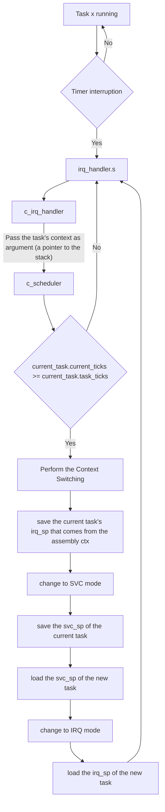

# Why And What

This project is focused on booting an ARMv7 processor using QEMU and GDB, primarily for educational purposes. The implementation combines both assembly language and C, allowing for a deep understanding of low-level programming and system architecture. However, there are small functions written in Rust, which aim to explore the feasibility of replacing C with Rust in certain parts of the project by utilizing the linker. This approach not only highlights the potential of Rust as a systems programming language but also provides an opportunity to compare its performance and safety features against the traditional C components.

## Table of Contents

- [Why And What](#why-and-what)
  - [Table of Contents](#table-of-contents)
- [Dependencies](#dependencies)
- [How](#how)
- [Scheduling](#scheduling)
  - [Resources](#resources)
- [What and Why Nix?](#what-and-why-nix)
- [References](#references)
  - [Extras](#extras)
    - [Booting](#booting)
    - [Exception Handling](#exception-handling)
    - [UART PL011](#uart-pl011)
    - [GIC](#gic)
    - [TIMER](#timer)
    - [Videos](#videos)
    - [Online Emulator](#online-emulator)
    - [GDB extras](#gdb-extras)

# Dependencies

Ubuntu/Debian packages:
- gcc-arm-none-eabi
- gdb-arm-none-eabi
- qemu-system

Or

Nix(package manager):
- [nix](https://nixos.org/download/) &rarr; installs `nix-shell`
- [nixfmt](https://github.com/NixOS/nixfmt) (optional)

# How

Project's sructure:

```
.
├── bin
│   └── image.bin   <- Binary image used by 'qemu'
├── core            <- Assembly files used to init the processor
├── kernel          <- C files
├── linker          <- Linker files
│   ├── mmap.ld
│   └── zynq.ld
├── obj             <- Object files generated by the Assembler
├── proc            <- Assembly functions used as "helpers" to init hw and peripherals
└── sys             <- Assembly files used to handle the syscalls
```

To build the project and assemble/compile files located at `core/*.s`/`sys/*.s`/`proc/*.s` and `kernel/*.c` run:

Using `nix-shell`:

```sh
make nix.build
```

Locally:

```sh
make build
```

To compile the `rust` drivers defined by `kernel/rs/drivers.rs` run the make command with the variable RS set to 1:

```sh
make build RS=1
```

> [!IMPORTANT]
> The Makefile contains targets for both the Nix package manager and Ubuntu/Debian packages. The targets starting with `nix.` should be fully functional on any machine that supports the nix-shell environment.

To build and run a tagged release:
1. Check out the desired tag using the command `git checkout tags/<tag_name>`.
2. Execute `make build` to build the project.
3. Run `make qemuA8` to execute the project on QEMU.
4. Open a new terminal and run `make debug` to debug the project.

# Scheduling

The scheduler works on top of the Timer interruptions, utilizing a straightforward algorithm designed for educational purposes. When a task is running, it continuously checks for timer interruptions. Upon receiving a timer interrupt, the system invokes the irq_handler.s, which then calls the c_irq_handler function, passing the current task's context as an argument (a pointer to the stack). The c_scheduler function is then executed to determine whether the current task has exceeded its allocated time slice, indicated by comparing current_task.current_ticks with current_task.task_ticks. If the task has not yet reached its time limit, the system returns to the interrupt handler to continue execution. However, if the time limit is reached, the scheduler performs context switching. This involves saving the current task's interrupt stack pointer (irq_sp) from the assembly context, switching to Supervisor (SVC) mode, and saving the SVC stack pointer of the current task. The scheduler then loads the SVC stack pointer of the next task to be executed, switches back to IRQ mode, and finally loads the interrupt stack pointer of the new task. This cycle repeats, ensuring efficient multitasking and responsive task management on the ARMv7 architecture. 

<style>
div.mermaid {
    text-align: center;
}
</style>

<div class="mermaid">



</div>


> [!IMPORTANT]
> There is a bug when printing inside the tasks, which seems to be a stack overflow problem. This issue requires further investigation and debugging to ensure the stability and reliability of the scheduler implementation.


## Resources
- [CPU Scheduling Basics - YouTube](https://www.youtube.com/watch?v=Jkmy2YLUbUY)
- [baremetal-arm/doc/08_scheduling.md at 09-wip · umanovskis/baremetal-arm · GitHub](https://github.com/umanovskis/baremetal-arm/blob/09-wip/doc/08_scheduling.md)

# What and Why Nix?

Nix is a powerful package manager for Linux and other Unix systems that makes package management reliable and reproducible. It aims to provide a robust and simple way to handle packages and their dependencies, ensuring that the same package setup can be replicated across multiple environments without any inconsistencies.

The key features of Nix are:

1. **Reproducibility:** Nix ensures that installing or upgrading one package cannot break other packages. It allows multiple versions of a package to coexist on the same system.

2. **Isolation:** Nix isolates packages from each other. This means that unlike traditional package managers, it doesn't have global state that can be mutated by packages.

These features make Nix an excellent tool for creating reproducible development environments, reducing the "it works on my machine" problem.

- [Nix Tutorial](https://nix.dev/tutorials/)
- [A step towards the future of configuration and infrastructure management with Nix](https://blog.container-solutions.com/step-towards-future-configuration-infrastructure-management-nix)
- [Is there much difference between using nix-shell and docker for local development? - Help - NixOS Discourse](https://discourse.nixos.org/t/is-there-much-difference-between-using-nix-shell-and-docker-for-local-development/807)
- [What is /usr/bin/env?](https://stackoverflow.com/questions/43793040/how-does-usr-bin-env-work-in-a-linux-shebang-line)
- [Nix + Make](https://www.reddit.com/r/NixOS/comments/8hefx5/nixshell_as_interpreter_for_a_makefile/)

# References

- [ARMV7 - ASM Quick Reference](https://courses.cs.washington.edu/courses/cse469/20wi/armv7.pdf)
- [ARM - Programmer's Guide](https://developer.arm.com/documentation/den0013/d)
- Machine used by QEMU &rarr; [RealView Platform Baseboard for Cortex-A8 User Guide](https://developer.arm.com/documentation/dui0417/d/programmer-s-reference)
- Genearal ARMv7 guide &rarr; [baremetal-arm/doc/00\_introduction.md at master · umanovskis/baremetal-arm](https://github.com/umanovskis/baremetal-arm/blob/master/doc/00_introduction.md)

## Extras

- [Guide for ARMv7-A | Registers](https://developer.arm.com/documentation/den0013/d/ARM-Processor-Modes-and-Registers/Registers)
- [LiteralPools | ldr](https://stackoverflow.com/a/17215118)

### Booting
- [ARMv7-A PSRs](https://developer.arm.com/documentation/ddi0406/b/System-Level-Architecture/The-System-Level-Programmers--Model/ARM-processor-modes-and-core-registers/Program-Status-Registers--PSRs-)
- [Guide for ARMv7-A | Booting](https://developer.arm.com/documentation/den0013/d/Boot-Code/Booting-a-bare-metal-system?lang=en)
- [ARM bootloader: Interrupt Vector Table Understanding - Stack Overflow](https://stackoverflow.com/questions/21312963/arm-bootloader-interrupt-vector-table-understanding)
- [VectorTable | Allocatable .section](https://stackoverflow.com/a/58713088)
- [Stack Pointer Init](https://developer.arm.com/documentation/dui0471/m/embedded-software-development/stack-pointer-initialization)
- [ARMv7-A Processor Modes](https://developer.arm.com/documentation/den0013/d/ARM-Processor-Modes-and-Registers)

### Exception Handling
Exceptions take into account the interrupts (`IRQs`): [Guide for ARMv7-A | Types of Exception](https://developer.arm.com/documentation/den0013/d/Exception-Handling/Types-of-exception)
- [ARM Developer Guide | Handling Exceptions](https://developer.arm.com/documentation/dui0056/d/handling-processor-exceptions)
- [Guide for ARMv7-A | Exception Handling](https://developer.arm.com/documentation/den0013/d/Exception-Handling/Exception-handling)
- [Guide for ARMv7-A | Return from exception](https://developer.arm.com/documentation/den0013/d/Exception-Handling/Exception-priorities/The-return-instruction)
- [Reference Manual | SVC and](https://developer.arm.com/documentation/ddi0403/d/Application-Level-Architecture/Instruction-Details/Alphabetical-list-of-ARMv7-M-Thumb-instructions/SVC)
- [Guide for ARMv7-A | Simplistic Interrupt Handling](https://developer.arm.com/documentation/den0013/d/Interrupt-Handling/External-interrupt-requests/Simplistic-interrupt-handling)
- [Guide for ARMv7-A | Nested Interrupt Handling](https://developer.arm.com/documentation/den0013/d/Interrupt-Handling/External-interrupt-requests/Nested-interrupt-handling)


### UART PL011
- [PrimeCell UART (PL011) Technical Reference Manual r1p5](https://developer.arm.com/documentation/ddi0183/g/programmers-model/summary-of-registers)
- [ARMs PL011 UART | Welcome to the Mike’s homepage!](https://krinkinmu.github.io/2020/11/29/PL011.html)
- [Hello world for bare metal ARM using QEMU | Freedom Embedded](https://balau82.wordpress.com/2010/02/28/hello-world-for-bare-metal-arm-using-qemu/)
- [Emulating ARM PL011 serial ports | Freedom Embedded](https://balau82.wordpress.com/2010/11/30/emulating-arm-pl011-serial-ports/)


### GIC
- [baremetal-arm/doc/07\_interrupts.md at master · umanovskis/baremetal-arm · GitHub](https://github.com/umanovskis/baremetal-arm/blob/master/doc/07_interrupts.md)
- [RealView Platform Baseboard for Cortex-A8 User Guide | GIC](https://developer.arm.com/documentation/dui0417/d/programmer-s-reference/generic-interrupt-controller--gic/generic-interrupt-controller-registers)
  - Important: Interrupt Acknowledge &rarr; has the irq number
- [RealView Platform Baseboard for Cortex-A8 User Guide | IRQs IDs](https://developer.arm.com/documentation/dui0417/d/programmer-s-reference/generic-interrupt-controller--gic/interrupt-signals)
  - TIMER0 ID: 36

### TIMER
- [ARM Dual-Timer Module (SP804) Technical Reference Manual r1p0](https://developer.arm.com/documentation/ddi0271/d/programmer-s-model/summary-of-registers)

### Videos

- [Introduction to Assembly Programming with ARM - Setting up Qemu for ARM - YouTube](https://www.youtube.com/watch?v=WubAuz4hPpY)
- [X86 Needs To Die - YouTube](https://www.youtube.com/watch?v=xCBrtopAG80)

### Online Emulator

- [CPUlator ARMv7 System Simulator](https://cpulator.01xz.net/?sys=arm)


### GDB extras

- [c - How do I show what fields a struct has in GDB? - Stack Overflow](https://stackoverflow.com/questions/1768620/how-do-i-show-what-fields-a-struct-has-in-gdb/42320040#42320040)
- [Debugging with GDB - Examining Data](https://web.mit.edu/gnu/doc/html/gdb_10.html)
